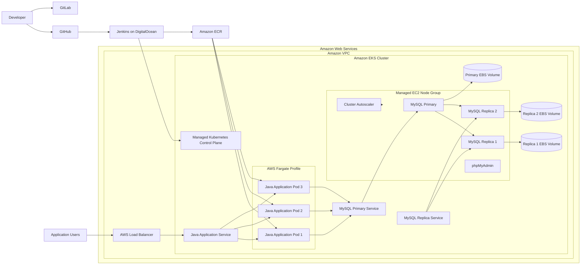

# Java–MySQL Platform on Amazon EKS

A production-aware Kubernetes platform that deploys a Java Spring Boot application and a replicated MySQL database to Amazon Elastic Kubernetes Service.

The platform uses Amazon EKS managed EC2 nodes, AWS Fargate, Amazon ECR, Jenkins CI/CD, encrypted EBS persistent storage, private database administration, and Kubernetes Cluster Autoscaler.

---

## Project Overview

This project migrates a Java–MySQL application from a local Kubernetes environment to Amazon EKS.

The main objective is to run the application and its supporting services on AWS while reducing operational overhead through managed Kubernetes services and automated CI/CD.

The platform separates workloads according to their operational requirements:

- MySQL and phpMyAdmin run on an Amazon EKS managed EC2 node group.
- The Java application runs as three replicas on AWS Fargate.
- Java application images are stored in a private Amazon ECR repository.
- Jenkins automatically tests, builds, publishes, and deploys application releases.
- Cluster Autoscaler manages the EC2 node group between one and three nodes.
- MySQL uses encrypted Amazon EBS `gp3` volumes for persistent storage.
- phpMyAdmin remains private and is accessed through Kubernetes port-forwarding.
- GitHub is used as the primary repository.
- GitLab is maintained as a secondary repository mirror.

---

## Exercise Requirements

This project implements the following assigned tasks:

### Exercise 1 — Create an EKS Cluster

- Create an Amazon EKS cluster using `eksctl`.
- Create a managed EC2 node group with three nodes.
- Create one AWS Fargate profile.

### Exercise 2 — Deploy MySQL and phpMyAdmin

- Deploy MySQL to the EC2 managed node group.
- Configure one MySQL primary and two replicas.
- Deploy phpMyAdmin to the EC2 managed node group.
- Use the Bitnami legacy MySQL container image.
- Use encrypted EBS persistent volumes.

### Exercise 3 — Deploy the Java Application

- Deploy the Java Spring Boot application to AWS Fargate.
- Run three application replicas.
- Connect the Java application to the MySQL primary Service.

### Exercise 4 — Automate Deployment with Jenkins

- Build and test the application automatically.
- Build a new container image.
- Push the image to a registry.
- Automatically deploy the new image to EKS.
- Wait for and validate the Kubernetes rollout.

### Exercise 5 — Use Amazon ECR

- Replace the previous container repository with Amazon ECR.
- Use immutable image tags.
- Enable image scanning.
- Authenticate dynamically during Jenkins builds.

### Exercise 6 — Configure Autoscaling

- Configure the EC2 managed node group with:
  - Minimum nodes: `1`
  - Desired nodes: `3`
  - Maximum nodes: `3`
- Install Kubernetes Cluster Autoscaler.
- Allow the managed node group to scale according to unschedulable workloads and available capacity.

---

## Architecture



---

## Platform Components

| Component | Purpose |
|---|---|
| Amazon EKS | Managed Kubernetes control plane |
| eksctl | EKS cluster and Fargate profile provisioning |
| Managed EC2 node group | Compute for MySQL, phpMyAdmin, and autoscaling components |
| AWS Fargate | Serverless Kubernetes compute for the Java application |
| Amazon ECR | Private container image repository |
| Amazon EBS CSI driver | Persistent volume provisioning for MySQL |
| Amazon EBS gp3 | Encrypted persistent storage for MySQL |
| Jenkins | Continuous integration and continuous deployment |
| Docker | Container image creation |
| Docker Buildx | Deterministic AMD64 container builds |
| Gradle | Java application build and testing |
| Spring Boot | Java application framework |
| MySQL | Replicated application database |
| phpMyAdmin | Private browser-based database administration |
| Cluster Autoscaler | EC2 managed node group scaling |
| Kubernetes Services | Internal and external workload networking |
| GitHub | Primary source repository and Jenkins integration |
| GitLab | Secondary source repository mirror |
| DigitalOcean | Jenkins server hosting |

---

## Workload Placement

### Managed EC2 Node Group

The following workloads run on EC2:

- MySQL primary
- MySQL replica 1
- MySQL replica 2
- phpMyAdmin
- Cluster Autoscaler
- EC2-targeted Kubernetes supporting workloads

The node group uses the label:

```text
workload-type=ec2
```

The scaling configuration is:

```text
Minimum nodes: 1
Desired nodes: 3
Maximum nodes: 3
```

The configured range satisfies the autoscaling exercise requirement.

Because MySQL uses Availability Zone-specific EBS volumes, the Cluster Autoscaler may not always be able to reduce the node group to one node. Scale-down depends on:

- EBS volume topology
- Pod resource requests
- MySQL Pod scheduling
- PodDisruptionBudgets
- Pod anti-affinity
- available node capacity
- whether Pods can be safely rescheduled

The autoscaling limits are configured correctly even when workload constraints prevent the cluster from reaching the minimum value.

---

### AWS Fargate

The Java application runs in the following namespace:

```text
java-app
```

The application runs with:

```text
3 replicas
```

The Fargate profile selects:

```text
Namespace: java-app
Pod label: compute-type=fargate
```

Java application Pods do not consume the managed EC2 node-group capacity.

---

## MySQL Architecture

The database runs with replication enabled:

```text
1 MySQL primary
2 MySQL replicas
```

The primary handles application read and write operations.

The replica Service can be used for read-only traffic when required.

Each MySQL Pod has its own encrypted EBS-backed persistent volume:

```text
data-mysql-primary-0
data-mysql-secondary-0
data-mysql-secondary-1
```

The database is exposed only through internal Kubernetes `ClusterIP` Services.

---

## Repository Structure

```text
.
├── .dockerignore
├── .gitignore
├── Dockerfile
├── Jenkinsfile
├── Makefile
├── README.md
├── build.gradle
├── settings.gradle
├── gradlew
├── gradlew.bat
│
├── gradle/
│   └── wrapper/
│       ├── gradle-wrapper.jar
│       └── gradle-wrapper.properties
│
├── eks/
│   ├── cluster.yaml
│   ├── cluster.local.yaml
│   ├── fargate-profile.yaml
│   └── iam/
│       ├── jenkins-eks-policy.json
│       └── cluster-autoscaler-policy.json
│
├── kubernetes/
│   ├── application/
│   │   ├── configmap.yaml
│   │   ├── deployment.yaml
│   │   ├── pdb.yaml
│   │   ├── secret.example.yaml
│   │   └── service.yaml
│   │
│   ├── autoscaling/
│   │   └── cluster-autoscaler-values.yaml
│   │
│   ├── database/
│   │   ├── mysql-values.example.yaml
│   │   ├── mysql-values.local.yaml
│   │   ├── phpmyadmin-deployment.yaml
│   │   └── phpmyadmin-service.yaml
│   │
│   ├── namespaces/
│   │   ├── database-namespace.yaml
│   │   └── java-app-namespace.yaml
│   │
│   └── storage/
│       └── gp3-storage-class.yaml
│
├── scripts/
│   ├── deploy-java-app.sh
│   ├── destroy-cluster.sh
│   ├── port-forward-phpmyadmin.sh
│   └── validate-platform.sh
│
├── src/
│   ├── main/
│   │   ├── java/
│   │   └── resources/
│   └── test/
│       └── java/
│
└── docs/
```

Files such as `cluster.local.yaml`, `mysql-values.local.yaml`, rendered Kubernetes manifests, kubeconfig files, and local Secrets are excluded from Git.

---

## Prerequisites

Install and configure the following tools:

- AWS CLI v2
- kubectl
- eksctl
- Helm
- Docker
- Docker Buildx
- Git
- jq
- envsubst
- Java 17
- Gradle Wrapper
- Jenkins
- GitHub account
- GitLab account
- DigitalOcean account for Jenkins hosting

Validate the tools:

```bash
aws --version
kubectl version --client
eksctl version
helm version
docker version
docker buildx version
git --version
jq --version
envsubst --version
java --version
./gradlew --version
```

---

## Environment Variables

Set the common project variables:

```bash
export AWS_PROFILE="eks-admin"
export AWS_REGION="ca-central-1"
export CLUSTER_NAME="java-mysql-eks"
export NODEGROUP_NAME="application-nodes"
export ECR_REPOSITORY="java-mysql-app"
```

Verify:

```bash
printf 'AWS profile: %s\n' "${AWS_PROFILE}"
printf 'AWS region: %s\n' "${AWS_REGION}"
printf 'Cluster name: %s\n' "${CLUSTER_NAME}"
printf 'Node group: %s\n' "${NODEGROUP_NAME}"
printf 'ECR repository: %s\n' "${ECR_REPOSITORY}"
```

---

## AWS Authentication

Configure a named AWS CLI profile:

```bash
aws configure \
  --profile eks-admin
```

Export the profile:

```bash
export AWS_PROFILE="eks-admin"
export AWS_REGION="ca-central-1"
```

Verify the current identity:

```bash
aws sts get-caller-identity \
  --profile "${AWS_PROFILE}"
```

Do not use the AWS root account for project operations.

---

## Create the EKS Cluster

Create the local cluster configuration:

```bash
cp \
  eks/cluster.yaml \
  eks/cluster.local.yaml
```

Open:

```text
eks/cluster.local.yaml
```

Replace all environment-specific placeholders, including:

- administrator public IP address
- Jenkins server public IP address
- SSH configuration if applicable
- account-specific values

The local cluster configuration must remain ignored by Git.

Validate the configuration:

```bash
eksctl create cluster \
  --config-file eks/cluster.local.yaml \
  --dry-run
```

Create the cluster:

```bash
eksctl create cluster \
  --config-file eks/cluster.local.yaml
```

Update kubeconfig:

```bash
aws eks update-kubeconfig \
  --name "${CLUSTER_NAME}" \
  --region "${AWS_REGION}" \
  --profile "${AWS_PROFILE}" \
  --alias "${CLUSTER_NAME}"
```

Validate:

```bash
eksctl get cluster \
  --name "${CLUSTER_NAME}" \
  --region "${AWS_REGION}" \
  --profile "${AWS_PROFILE}"
```

```bash
kubectl get nodes \
  -o wide
```

```bash
kubectl get pods \
  --namespace kube-system
```

Expected result:

```text
3 Ready EC2 worker nodes
1 active EKS cluster
```

---

## Create Kubernetes Namespaces

Apply the application and database namespaces:

```bash
kubectl apply \
  -f kubernetes/namespaces/java-app-namespace.yaml \
  -f kubernetes/namespaces/database-namespace.yaml
```

Validate:

```bash
kubectl get namespaces \
  java-app \
  database
```

---

## Create the Fargate Profile

Create the Fargate profile:

```bash
eksctl create fargateprofile \
  --config-file eks/fargate-profile.yaml \
  --profile "${AWS_PROFILE}"
```

Validate:

```bash
eksctl get fargateprofile \
  --cluster "${CLUSTER_NAME}" \
  --region "${AWS_REGION}" \
  --profile "${AWS_PROFILE}"
```

Confirm the profile status:

```bash
aws eks describe-fargate-profile \
  --cluster-name "${CLUSTER_NAME}" \
  --fargate-profile-name java-app-fargate \
  --region "${AWS_REGION}" \
  --profile "${AWS_PROFILE}" \
  --query 'fargateProfile.{
    Name:fargateProfileName,
    Status:status,
    Subnets:subnets,
    Selectors:selectors
  }' \
  --output json
```

Expected status:

```text
ACTIVE
```

---

## Deploy the EBS StorageClass

Apply the encrypted `gp3` StorageClass:

```bash
kubectl apply \
  -f kubernetes/storage/gp3-storage-class.yaml
```

Validate:

```bash
kubectl get storageclass
```

Confirm that the EBS CSI add-on is available:

```bash
aws eks describe-addon \
  --cluster-name "${CLUSTER_NAME}" \
  --addon-name aws-ebs-csi-driver \
  --region "${AWS_REGION}" \
  --profile "${AWS_PROFILE}" \
  --query 'addon.{
    Name:addonName,
    Status:status,
    Version:addonVersion
  }' \
  --output table
```

Expected status:

```text
ACTIVE
```

---

## Configure MySQL Values

Create a local values file:

```bash
cp \
  kubernetes/database/mysql-values.example.yaml \
  kubernetes/database/mysql-values.local.yaml
```

Open:

```text
kubernetes/database/mysql-values.local.yaml
```

Replace all password placeholders.

The Bitnami legacy image configuration must include:

```yaml
global:
  security:
    allowInsecureImages: true

image:
  registry: docker.io
  repository: bitnamilegacy/mysql
  tag: 9.4.0-debian-12-r1
```

Do not use `latest` for the final project because a pinned image version provides more predictable deployments.

The local values file must not be committed.

---

## Deploy MySQL

Add the Bitnami Helm repository:

```bash
helm repo add bitnami \
  https://charts.bitnami.com/bitnami
```

Update Helm repositories:

```bash
helm repo update
```

Install MySQL:

```bash
helm upgrade --install mysql \
  bitnami/mysql \
  --version 14.0.3 \
  --namespace database \
  --create-namespace \
  --values kubernetes/database/mysql-values.local.yaml \
  --wait \
  --wait-for-jobs \
  --timeout 30m
```

Validate the release:

```bash
helm status mysql \
  --namespace database
```

Validate the StatefulSets:

```bash
kubectl get statefulsets \
  --namespace database
```

Expected:

```text
mysql-primary     1/1
mysql-secondary   2/2
```

Validate Pods, Services, and storage:

```bash
kubectl get pods,services,pvc \
  --namespace database \
  -o wide
```

Expected Pods:

```text
mysql-primary-0
mysql-secondary-0
mysql-secondary-1
```

Expected PVCs:

```text
data-mysql-primary-0
data-mysql-secondary-0
data-mysql-secondary-1
```

All PVCs should show:

```text
STATUS: Bound
STORAGECLASS: gp3
```

---

## Validate MySQL Replication

Check replica 1:

```bash
kubectl exec \
  --namespace database \
  mysql-secondary-0 \
  --container mysql \
  -- /bin/bash -ec '
    export MYSQL_PWD="$(cat /opt/bitnami/mysql/secrets/mysql-root-password)"

    mysql \
      --user=root \
      --vertical \
      --execute="SHOW REPLICA STATUS;" \
    | grep -E \
      "Source_Host:|Replica_IO_Running:|Replica_SQL_Running:|Seconds_Behind_Source:|Last_IO_Error:|Last_SQL_Error:"
  '
```

Check replica 2:

```bash
kubectl exec \
  --namespace database \
  mysql-secondary-1 \
  --container mysql \
  -- /bin/bash -ec '
    export MYSQL_PWD="$(cat /opt/bitnami/mysql/secrets/mysql-root-password)"

    mysql \
      --user=root \
      --vertical \
      --execute="SHOW REPLICA STATUS;" \
    | grep -E \
      "Source_Host:|Replica_IO_Running:|Replica_SQL_Running:|Seconds_Behind_Source:|Last_IO_Error:|Last_SQL_Error:"
  '
```

Expected:

```text
Replica_IO_Running: Yes
Replica_SQL_Running: Yes
Seconds_Behind_Source: 0
Last_IO_Error:
Last_SQL_Error:
```

---

## Deploy phpMyAdmin

Apply the phpMyAdmin Deployment and Service:

```bash
kubectl apply \
  -f kubernetes/database/phpmyadmin-deployment.yaml \
  -f kubernetes/database/phpmyadmin-service.yaml
```

Validate:

```bash
kubectl get deployment,pods,service \
  --namespace database \
  -l app.kubernetes.io/name=phpmyadmin
```

Access phpMyAdmin privately:

```bash
./scripts/port-forward-phpmyadmin.sh
```

Alternatively:

```bash
kubectl port-forward \
  --namespace database \
  service/phpmyadmin \
  8081:80
```

Open:

```text
http://127.0.0.1:8081
```

phpMyAdmin is intentionally not exposed publicly.

---

## Create the Amazon ECR Repository

Create an immutable ECR repository:

```bash
aws ecr create-repository \
  --repository-name "${ECR_REPOSITORY}" \
  --image-tag-mutability IMMUTABLE \
  --image-scanning-configuration scanOnPush=true \
  --region "${AWS_REGION}" \
  --profile "${AWS_PROFILE}"
```

Get the repository URI:

```bash
export ECR_REPOSITORY_URL="$(
  aws ecr describe-repositories \
    --repository-names "${ECR_REPOSITORY}" \
    --region "${AWS_REGION}" \
    --profile "${AWS_PROFILE}" \
    --query 'repositories[0].repositoryUri' \
    --output text
)"
```

Display it:

```bash
echo "${ECR_REPOSITORY_URL}"
```

Authenticate Docker to ECR:

```bash
aws ecr get-login-password \
  --region "${AWS_REGION}" \
  --profile "${AWS_PROFILE}" \
| docker login \
    --username AWS \
    --password-stdin \
    "$(echo "${ECR_REPOSITORY_URL}" | cut -d/ -f1)"
```

---

## Build and Push the Java Image Manually

Set a unique image tag:

```bash
export IMAGE_TAG="1.0.0"
```

Build and push an AMD64 image:

```bash
docker buildx build \
  --platform linux/amd64 \
  --tag "${ECR_REPOSITORY_URL}:${IMAGE_TAG}" \
  --provenance=true \
  --push \
  .
```

Verify the image:

```bash
docker buildx imagetools inspect \
  "${ECR_REPOSITORY_URL}:${IMAGE_TAG}"
```

Expected platform:

```text
linux/amd64
```

Verify the image in ECR:

```bash
aws ecr describe-images \
  --repository-name "${ECR_REPOSITORY}" \
  --image-ids imageTag="${IMAGE_TAG}" \
  --region "${AWS_REGION}" \
  --profile "${AWS_PROFILE}" \
  --query 'imageDetails[0].{
    Digest:imageDigest,
    Tags:imageTags,
    Pushed:imagePushedAt
  }' \
  --output table
```

Because the repository uses immutable tags, do not reuse an existing tag.

---

## Create the Java Application Secret

Set the database values locally:

```bash
export DB_USER="java_app_user"
export DB_PASSWORD="REPLACE_WITH_CURRENT_DATABASE_PASSWORD"
```

Create or update the Kubernetes Secret:

```bash
kubectl create secret generic java-app-secret \
  --namespace java-app \
  --from-literal=DB_USER="${DB_USER}" \
  --from-literal=DB_PWD="${DB_PASSWORD}" \
  --dry-run=client \
  --output=yaml \
| kubectl apply -f -
```

Validate only the Secret metadata:

```bash
kubectl get secret java-app-secret \
  --namespace java-app
```

Do not display or commit the Secret contents.

---

## Deploy the Java Application Manually

Create the rendered-manifest directory:

```bash
mkdir -p rendered
```

Export the image values:

```bash
export ECR_REPOSITORY_URL="$(
  aws ecr describe-repositories \
    --repository-names "${ECR_REPOSITORY}" \
    --region "${AWS_REGION}" \
    --profile "${AWS_PROFILE}" \
    --query 'repositories[0].repositoryUri' \
    --output text
)"
```

```bash
export IMAGE_TAG="1.0.0"
```

Render the Deployment:

```bash
envsubst \
  '${ECR_REPOSITORY_URL} ${IMAGE_TAG}' \
  < kubernetes/application/deployment.yaml \
  > rendered/java-app-deployment.yaml
```

Ensure the file ends with a newline:

```bash
python3 - <<'PY'
from pathlib import Path

path = Path("rendered/java-app-deployment.yaml")
content = path.read_text()

if not content.endswith("\n"):
    path.write_text(content + "\n")
PY
```

Confirm the rendered image:

```bash
grep -n "image:" \
  rendered/java-app-deployment.yaml
```

Confirm no unresolved placeholders remain:

```bash
if grep -nE \
  'ECR_REPOSITORY_URL|IMAGE_TAG|YOUR_|PLACEHOLDER' \
  rendered/java-app-deployment.yaml
then
  echo "ERROR: unresolved placeholders remain." >&2
  exit 1
else
  echo "PASS: all placeholders were replaced."
fi
```

Validate locally:

```bash
kubectl apply \
  --dry-run=client \
  -f rendered/java-app-deployment.yaml
```

Validate against the cluster:

```bash
kubectl apply \
  --dry-run=server \
  -f rendered/java-app-deployment.yaml
```

Apply all application manifests:

```bash
kubectl apply \
  -f kubernetes/application/configmap.yaml \
  -f kubernetes/application/service.yaml \
  -f rendered/java-app-deployment.yaml \
  -f kubernetes/application/pdb.yaml
```

Wait for the rollout:

```bash
kubectl rollout status \
  deployment/java-app \
  --namespace java-app \
  --timeout=600s
```

Validate the Pods:

```bash
kubectl get pods \
  --namespace java-app \
  -l app.kubernetes.io/name=java-app \
  -o wide
```

Expected:

```text
3 Running Pods
Fargate-backed node names
0 unexpected restarts
```

Verify the non-root user:

```bash
JAVA_APP_POD="$(
  kubectl get pods \
    --namespace java-app \
    -l app.kubernetes.io/name=java-app \
    -o jsonpath='{.items[0].metadata.name}'
)"
```

```bash
kubectl exec \
  --namespace java-app \
  "${JAVA_APP_POD}" \
  -- id
```

Expected:

```text
uid=10001(appuser) gid=10001(appgroup)
```

---

## Access the Java Application

Check the Service:

```bash
kubectl get service java-app \
  --namespace java-app
```

Get the LoadBalancer hostname:

```bash
export APP_HOST="$(
  kubectl get service java-app \
    --namespace java-app \
    --output=jsonpath='{.status.loadBalancer.ingress[0].hostname}'
)"
```

Display it:

```bash
echo "${APP_HOST}"
```

Test:

```bash
curl \
  --retry 10 \
  --retry-delay 10 \
  --max-time 30 \
  "http://${APP_HOST}/"
```

Local port-forwarding can also be used:

```bash
kubectl port-forward \
  --namespace java-app \
  service/java-app \
  8080:80
```

Open:

```text
http://127.0.0.1:8080
```

---

## Jenkins Architecture

Jenkins runs as a Docker container on a DigitalOcean Droplet.

Required Jenkins tools include:

- Git
- Docker CLI
- Docker Buildx
- AWS CLI v2
- kubectl
- envsubst
- Java 17
- access to the host Docker daemon
- AWS credentials
- GitHub credentials
- database credentials
- network access to the EKS public API endpoint

The Jenkins container connects to the host Docker socket:

```text
/var/run/docker.sock
```

The Jenkins container is started with the host Docker group ID instead of making the Docker socket world-writable.

---

## Jenkins Credentials

The Jenkins global credential store contains:

| Credential ID | Type | Purpose |
|---|---|---|
| `github-token` | Username with password | GitHub repository access |
| `jenkins-aws-access-key-id` | Secret text | Jenkins IAM access key ID |
| `jenkins-aws-secret-access-key` | Secret text | Jenkins IAM secret access key |
| `java-db-user` | Secret text | Java application MySQL username |
| `java-db-password` | Secret text | Java application MySQL password |

The AWS key pair belongs to the dedicated IAM user:

```text
jenkins-eks-deployer
```

Do not use the administrator IAM user inside Jenkins.

---

## Jenkins IAM Access

The Jenkins IAM identity is restricted to the permissions required for:

- identifying the AWS account
- describing the target EKS cluster
- authenticating to ECR
- reading and publishing images to the application ECR repository

The Jenkins IAM user is granted Kubernetes access through an EKS access entry.

The access policy is scoped to:

```text
Namespace: java-app
Policy: AmazonEKSEditPolicy
```

Jenkins does not receive unrestricted cluster administrator access.

---

## Jenkins Pipeline Behaviour

The project uses a Jenkins Multibranch Pipeline.

### Feature Branches

Feature branches perform:

- repository checkout
- required-file validation
- tool validation
- Gradle tests

Feature branches do not publish images or deploy to EKS.

### Develop Branch

The `develop` branch performs:

- repository checkout
- required-file validation
- tool validation
- Gradle tests
- application packaging validation

The `develop` branch does not deploy to EKS.

### Main Branch

The `main` branch performs:

1. Checkout
2. Required-file validation
3. Tool validation
4. Gradle testing
5. AWS identity validation
6. ECR metadata generation
7. ECR authentication
8. AMD64 image build
9. ECR image push
10. EKS kubeconfig generation
11. Kubernetes permission validation
12. Application Secret creation or update
13. Kubernetes Deployment rendering
14. Manifest validation
15. EKS deployment
16. Rollout validation
17. Replica validation
18. Deployed-image validation
19. Temporary credential and workspace cleanup

Image tags use:

```text
1.0.<Jenkins build number>-<short Git commit>
```

Example:

```text
1.0.12-8145ba5
```

This provides immutable and traceable releases.

---

## Cluster Autoscaling

The EC2 managed node group is configured with:

```text
Minimum nodes: 1
Desired nodes: 3
Maximum nodes: 3
```

Confirm the current settings:

```bash
aws eks describe-nodegroup \
  --cluster-name "${CLUSTER_NAME}" \
  --nodegroup-name "${NODEGROUP_NAME}" \
  --region "${AWS_REGION}" \
  --profile "${AWS_PROFILE}" \
  --query 'nodegroup.scalingConfig' \
  --output table
```

Expected:

```text
minSize: 1
desiredSize: 3
maxSize: 3
```

---

## Cluster Autoscaler IAM Policy

Validate the policy:

```bash
jq empty \
  eks/iam/cluster-autoscaler-policy.json
```

Create the IAM policy:

```bash
aws iam create-policy \
  --policy-name JavaMysqlEksClusterAutoscalerPolicy \
  --policy-document file://eks/iam/cluster-autoscaler-policy.json \
  --profile "${AWS_PROFILE}"
```

Get the policy ARN:

```bash
export CLUSTER_AUTOSCALER_POLICY_ARN="$(
  aws iam list-policies \
    --scope Local \
    --profile "${AWS_PROFILE}" \
    --query \
      "Policies[?PolicyName=='JavaMysqlEksClusterAutoscalerPolicy'].Arn | [0]" \
    --output text
)"
```

Verify:

```bash
echo "${CLUSTER_AUTOSCALER_POLICY_ARN}"
```

---

## Cluster Autoscaler IRSA

Associate the IAM OIDC provider:

```bash
eksctl utils associate-iam-oidc-provider \
  --cluster "${CLUSTER_NAME}" \
  --region "${AWS_REGION}" \
  --profile "${AWS_PROFILE}" \
  --approve
```

Create the Cluster Autoscaler IAM service account:

```bash
eksctl create iamserviceaccount \
  --cluster "${CLUSTER_NAME}" \
  --region "${AWS_REGION}" \
  --profile "${AWS_PROFILE}" \
  --namespace kube-system \
  --name cluster-autoscaler \
  --attach-policy-arn "${CLUSTER_AUTOSCALER_POLICY_ARN}" \
  --role-name JavaMysqlEksClusterAutoscalerRole \
  --override-existing-serviceaccounts \
  --approve
```

Validate:

```bash
kubectl get serviceaccount cluster-autoscaler \
  --namespace kube-system \
  --output yaml
```

Confirm the ServiceAccount has an annotation similar to:

```yaml
eks.amazonaws.com/role-arn: arn:aws:iam::AWS_ACCOUNT_ID:role/JavaMysqlEksClusterAutoscalerRole
```

Do not commit the account-specific ARN into the repository.

---

## Install Cluster Autoscaler

Get the EKS Kubernetes version:

```bash
export KUBERNETES_VERSION="$(
  aws eks describe-cluster \
    --name "${CLUSTER_NAME}" \
    --region "${AWS_REGION}" \
    --profile "${AWS_PROFILE}" \
    --query 'cluster.version' \
    --output text
)"
```

Display it:

```bash
echo "${KUBERNETES_VERSION}"
```

The Cluster Autoscaler major and minor version must match the EKS Kubernetes major and minor version.

Add the Helm repository:

```bash
helm repo add autoscaler \
  https://kubernetes.github.io/autoscaler
```

Update Helm:

```bash
helm repo update
```

Review available chart versions:

```bash
helm search repo autoscaler/cluster-autoscaler \
  --versions \
  | head -20
```

Update the image version in:

```text
kubernetes/autoscaling/cluster-autoscaler-values.yaml
```

Install:

```bash
helm upgrade --install cluster-autoscaler \
  autoscaler/cluster-autoscaler \
  --namespace kube-system \
  --values kubernetes/autoscaling/cluster-autoscaler-values.yaml \
  --wait \
  --timeout 10m
```

Validate:

```bash
kubectl rollout status \
  deployment/cluster-autoscaler \
  --namespace kube-system \
  --timeout=300s
```

Check Pods:

```bash
kubectl get pods \
  --namespace kube-system \
  --show-labels \
  | grep cluster-autoscaler
```

Check logs:

```bash
kubectl logs \
  --namespace kube-system \
  deployment/cluster-autoscaler \
  --tail=200
```

---

## Validate Auto Scaling Group Discovery Tags

Get the managed node-group Auto Scaling Group:

```bash
export ASG_NAME="$(
  aws eks describe-nodegroup \
    --cluster-name "${CLUSTER_NAME}" \
    --nodegroup-name "${NODEGROUP_NAME}" \
    --region "${AWS_REGION}" \
    --profile "${AWS_PROFILE}" \
    --query 'nodegroup.resources.autoScalingGroups[0].name' \
    --output text
)"
```

Display it:

```bash
echo "${ASG_NAME}"
```

Inspect the Auto Scaling Group tags:

```bash
aws autoscaling describe-tags \
  --region "${AWS_REGION}" \
  --profile "${AWS_PROFILE}" \
  --filters \
    "Name=auto-scaling-group,Values=${ASG_NAME}" \
  --query 'Tags[].{
    Key:Key,
    Value:Value,
    PropagateAtLaunch:PropagateAtLaunch
  }' \
  --output table
```

Required tags:

```text
k8s.io/cluster-autoscaler/enabled = true
k8s.io/cluster-autoscaler/java-mysql-eks = owned
```

Add them if they are missing:

```bash
aws autoscaling create-or-update-tags \
  --region "${AWS_REGION}" \
  --profile "${AWS_PROFILE}" \
  --tags \
    "ResourceId=${ASG_NAME},ResourceType=auto-scaling-group,Key=k8s.io/cluster-autoscaler/enabled,Value=true,PropagateAtLaunch=true" \
    "ResourceId=${ASG_NAME},ResourceType=auto-scaling-group,Key=k8s.io/cluster-autoscaler/${CLUSTER_NAME},Value=owned,PropagateAtLaunch=true"
```

---

## Test Cluster Scale-Up

Create a temporary workload file:

```bash
cat > /tmp/autoscaler-load-test.yaml <<'EOF'
---
apiVersion: apps/v1
kind: Deployment
metadata:
  name: autoscaler-load-test
  namespace: database
  labels:
    app.kubernetes.io/name: autoscaler-load-test
    app.kubernetes.io/part-of: java-mysql-eks-platform
spec:
  replicas: 8

  selector:
    matchLabels:
      app.kubernetes.io/name: autoscaler-load-test

  template:
    metadata:
      labels:
        app.kubernetes.io/name: autoscaler-load-test

    spec:
      nodeSelector:
        workload-type: ec2

      terminationGracePeriodSeconds: 5

      containers:
        - name: pause
          image: registry.k8s.io/pause:3.10
          imagePullPolicy: IfNotPresent

          resources:
            requests:
              cpu: 700m
              memory: 700Mi
            limits:
              cpu: 700m
              memory: 700Mi

          securityContext:
            allowPrivilegeEscalation: false
            capabilities:
              drop:
                - ALL
            runAsNonRoot: true
            runAsUser: 65534
            readOnlyRootFilesystem: true
EOF
```

Confirm current nodes:

```bash
kubectl get nodes \
  -o wide
```

Apply the load:

```bash
kubectl apply \
  -f /tmp/autoscaler-load-test.yaml
```

Watch Pods:

```bash
kubectl get pods \
  --namespace database \
  --watch
```

In another terminal, watch nodes:

```bash
kubectl get nodes \
  --watch
```

In another terminal, follow autoscaler logs:

```bash
kubectl logs \
  --namespace kube-system \
  deployment/cluster-autoscaler \
  --follow
```

Expected behaviour:

1. Some test Pods become `Pending`.
2. Cluster Autoscaler detects unschedulable Pods.
3. The managed node-group desired capacity increases.
4. A new EC2 node joins the cluster.
5. Pending Pods become `Running`.
6. The node group does not exceed three nodes.

Delete the test workload:

```bash
kubectl delete \
  -f /tmp/autoscaler-load-test.yaml
```

---

## Test Cluster Scale-Down

After deleting the temporary load:

```bash
kubectl get nodes \
  --watch
```

Follow the autoscaler logs:

```bash
kubectl logs \
  --namespace kube-system \
  deployment/cluster-autoscaler \
  --follow
```

Scale-down is not immediate.

Cluster Autoscaler waits before removing nodes and only removes a node when its workloads can be safely rescheduled.

Possible reasons the cluster may not reach one node include:

- EBS volume Availability Zone restrictions
- MySQL resource requests
- PodDisruptionBudgets
- MySQL replication placement
- anti-affinity rules
- system workloads
- insufficient capacity on the remaining node

Do not manually terminate EC2 instances to simulate autoscaling.

---

## Security Practices

The project implements the following security controls:

- AWS root credentials are not used.
- Jenkins uses a dedicated IAM user.
- Jenkins IAM permissions are restricted.
- Jenkins Kubernetes access is namespace-scoped.
- Cluster Autoscaler uses IRSA.
- ECR image tags are immutable.
- ECR image scanning is enabled.
- Database credentials are stored in Jenkins Credentials.
- Runtime credentials are stored in Kubernetes Secrets.
- Secret values are never committed.
- kubeconfig files are ignored.
- local Helm values are ignored.
- EC2 worker-node SSH access is disabled.
- Java containers run as a non-root user.
- The Java container uses numeric UID and GID values.
- Linux capabilities are dropped.
- Privilege escalation is disabled.
- The Java container uses a read-only root filesystem.
- Temporary writable storage is mounted only at `/tmp`.
- phpMyAdmin is private.
- MySQL uses internal `ClusterIP` Services.
- MySQL EBS volumes are encrypted.
- Jenkins deletes temporary kubeconfig files.
- Jenkins deletes rendered manifests after builds.
- Jenkins generates temporary ECR authentication tokens for each build.
- Permanent ECR passwords are not stored.
- Docker socket access is granted through the Docker group ID.
- The Docker socket is not changed to mode `666`.
- Public EKS API access is restricted to approved `/32` IP addresses.

---

## Files That Must Never Be Committed

Never commit:

- AWS access keys
- AWS secret access keys
- GitHub tokens
- GitLab tokens
- Jenkins credential values
- database passwords
- MySQL root passwords
- MySQL replication passwords
- kubeconfig files
- SSH private keys
- rendered Kubernetes Secrets
- local `.env` files
- real Helm secret values
- `cluster.local.yaml`
- `mysql-values.local.yaml`
- `secret.local.yaml`
- Jenkins home data
- Terraform state files if Terraform is added later

---

## Platform Validation

Make the validation script executable:

```bash
chmod +x \
  scripts/validate-platform.sh
```

Run:

```bash
AWS_PROFILE="${AWS_PROFILE}" \
AWS_REGION="${AWS_REGION}" \
CLUSTER_NAME="${CLUSTER_NAME}" \
NODEGROUP_NAME="${NODEGROUP_NAME}" \
./scripts/validate-platform.sh
```

The validation script checks:

- AWS identity
- EKS cluster status
- kubectl context
- Ready EC2 nodes
- active Fargate profile
- MySQL StatefulSets
- MySQL Pods
- bound EBS volumes
- Java application rollout
- three available Java replicas
- Fargate scheduling
- LoadBalancer hostname
- HTTP application response
- Cluster Autoscaler Deployment
- managed node-group minimum and maximum size

Expected final message:

```text
Validation successful.
```

---

## Makefile Commands

Display available commands:

```bash
make help
```

Create the cluster:

```bash
make cluster
```

Create the Fargate profile:

```bash
make fargate
```

Deploy MySQL and phpMyAdmin:

```bash
make database
```

Deploy the Java application:

```bash
make app
```

Validate the platform:

```bash
make validate
```

Port-forward phpMyAdmin:

```bash
make phpmyadmin
```

Destroy the project:

```bash
make destroy
```

---

## Git Workflow

The repository uses:

```text
main
  ↑
develop
  ↑
feature/*
  ↑
fix/*
  ↑
hotfix/*
```

Create a feature branch:

```bash
git checkout develop
git pull --ff-only github develop

git checkout -b feature/feature-name
```

Commit:

```bash
git add .
git commit \
  -m "feat(scope): describe the completed work"
```

Push to GitHub:

```bash
git push -u github feature/feature-name
```

Push to GitLab:

```bash
git push -u gitlab feature/feature-name
```

Merge into `develop`:

```bash
git checkout develop
git pull --ff-only github develop

git merge --no-ff feature/feature-name \
  -m "merge: add completed feature"
```

Push:

```bash
git push github develop
git push gitlab develop
```

Promote to production:

```bash
git checkout main
git pull --ff-only github main

git merge --no-ff develop \
  -m "merge: release Java MySQL EKS platform"
```

Push:

```bash
git push github main
git push gitlab main
```

---

## Release Tag

After final validation:

```bash
git tag -a v1.0.0 \
  -m "Release Java MySQL EKS platform with Jenkins CI/CD"
```

Push to GitHub:

```bash
git push github v1.0.0
```

Push to GitLab:

```bash
git push gitlab v1.0.0
```

Review the Git history:

```bash
git log \
  --graph \
  --oneline \
  --decorate \
  --all
```

---

## Cleanup

Deleting this project removes paid AWS infrastructure.

Run the cleanup only when the project is no longer required for:

- demonstration
- screenshots
- portfolio evidence
- testing
- troubleshooting
- assessment review

Delete the Java LoadBalancer Service first:

```bash
kubectl delete service java-app \
  --namespace java-app \
  --ignore-not-found=true \
  --wait=true
```

Wait for AWS Load Balancer cleanup:

```bash
sleep 60
```

Run the cleanup script:

```bash
chmod +x \
  scripts/destroy-cluster.sh
```

```bash
AWS_PROFILE="${AWS_PROFILE}" \
AWS_REGION="${AWS_REGION}" \
CLUSTER_NAME="${CLUSTER_NAME}" \
./scripts/destroy-cluster.sh
```

After deletion, review the AWS Console for leftover resources:

- CloudFormation stacks
- EC2 Load Balancers
- EBS volumes
- Elastic network interfaces
- CloudWatch log groups
- ECR repositories
- IAM roles
- IAM policies
- Auto Scaling Groups
- security groups
- public IP resources

---

## Troubleshooting

### AWS commands return AccessDenied

Check the active identity:

```bash
aws sts get-caller-identity \
  --profile "${AWS_PROFILE}"
```

Confirm the expected profile:

```bash
echo "${AWS_PROFILE}"
```

---

### kubectl returns Unauthorized

Update kubeconfig:

```bash
aws eks update-kubeconfig \
  --name "${CLUSTER_NAME}" \
  --region "${AWS_REGION}" \
  --profile "${AWS_PROFILE}" \
  --alias "${CLUSTER_NAME}"
```

Check EKS access entries:

```bash
aws eks list-access-entries \
  --cluster-name "${CLUSTER_NAME}" \
  --region "${AWS_REGION}" \
  --profile "${AWS_PROFILE}"
```

---

### Jenkins cannot reach the EKS API

Confirm the Jenkins Droplet public IP:

```bash
curl -4 \
  --silent \
  https://checkip.amazonaws.com
```

Confirm the IP is included in:

```bash
aws eks describe-cluster \
  --name "${CLUSTER_NAME}" \
  --region "${AWS_REGION}" \
  --profile "${AWS_PROFILE}" \
  --query 'cluster.resourcesVpcConfig.publicAccessCidrs'
```

The Jenkins public IP should be configured as a `/32` CIDR.

---

### Java Pods remain Pending

Describe the Pod:

```bash
kubectl describe pod \
  POD_NAME \
  --namespace java-app
```

Check the Fargate profile:

```bash
eksctl get fargateprofile \
  --cluster "${CLUSTER_NAME}" \
  --region "${AWS_REGION}" \
  --profile "${AWS_PROFILE}"
```

Possible causes:

- no matching Fargate profile
- namespace mismatch
- missing `compute-type=fargate` label
- unsupported Fargate Pod configuration
- invalid resource combination
- inactive Fargate profile

---

### Java Pods run on EC2

Confirm the application namespace:

```text
java-app
```

Confirm the Pod label:

```yaml
compute-type: fargate
```

Confirm the Fargate profile selector matches both values.

---

### MySQL Pods run on Fargate

Ensure MySQL uses:

```yaml
nodeSelector:
  workload-type: ec2
```

Confirm the Pods are in:

```text
database
```

---

### MySQL PVC remains Pending

Inspect the PVC:

```bash
kubectl describe pvc \
  PVC_NAME \
  --namespace database
```

Check StorageClasses:

```bash
kubectl get storageclass
```

Check the EBS CSI driver:

```bash
kubectl get pods \
  --namespace kube-system \
  | grep ebs
```

---

### ECR Push Fails with No Basic Authentication Credentials

Authenticate again:

```bash
aws ecr get-login-password \
  --region "${AWS_REGION}" \
  --profile "${AWS_PROFILE}" \
| docker login \
    --username AWS \
    --password-stdin \
    "$(echo "${ECR_REPOSITORY_URL}" | cut -d/ -f1)"
```

ECR authentication tokens expire and must be generated again when required.

---

### ECR Push Fails Because the Tag Is Immutable

Create a new image tag:

```bash
export IMAGE_TAG="1.0.1"
```

Jenkins automatically generates unique tags using:

```text
1.0.BUILD_NUMBER-GIT_SHA
```

Do not reuse an existing immutable tag.

---

### Fargate Cannot Pull an ECR Image

Inspect the Pod events:

```bash
kubectl describe pod \
  POD_NAME \
  --namespace java-app
```

Possible causes:

- no network path to ECR
- missing VPC endpoints
- incorrect security-group rules
- incorrect image architecture
- invalid repository URI
- missing image tag
- insufficient Fargate Pod execution-role permissions

Verify the image architecture:

```bash
docker buildx imagetools inspect \
  "${ECR_REPOSITORY_URL}:${IMAGE_TAG}"
```

Expected:

```text
linux/amd64
```

---

### Container Cannot Start with runAsNonRoot

Ensure the Dockerfile uses numeric values:

```dockerfile
ARG APP_UID=10001
ARG APP_GID=10001

USER 10001:10001
```

Ensure the Kubernetes Deployment uses:

```yaml
securityContext:
  runAsNonRoot: true
  runAsUser: 10001
  runAsGroup: 10001
```

---

### Jenkins Cannot Use Docker

Inside Jenkins:

```bash
docker --version
docker buildx version
```

On the Jenkins host:

```bash
ls -l /var/run/docker.sock
getent group docker
```

Start the Jenkins container with:

```text
--group-add DOCKER_GID
```

Do not use:

```bash
chmod 666 /var/run/docker.sock
```

---

### Jenkins Credential Cannot Be Found

Verify the exact credential IDs:

```text
jenkins-aws-access-key-id
jenkins-aws-secret-access-key
java-db-user
java-db-password
github-token
```

Jenkins credential IDs are case-sensitive.

---

### Cluster Autoscaler Does Not Scale

Check logs:

```bash
kubectl logs \
  --namespace kube-system \
  deployment/cluster-autoscaler \
  --tail=200
```

Confirm the ASG tags:

```bash
aws autoscaling describe-tags \
  --region "${AWS_REGION}" \
  --profile "${AWS_PROFILE}" \
  --filters \
    "Name=auto-scaling-group,Values=${ASG_NAME}"
```

Confirm:

```text
Minimum: 1
Maximum: 3
```

Possible causes:

- missing Auto Scaling Group discovery tags
- missing IRSA permissions
- incompatible Cluster Autoscaler version
- no genuinely unschedulable Pods
- incorrect Pod node selector
- node-group maximum already reached
- EBS topology restrictions
- PodDisruptionBudgets
- resource requests
- anti-affinity
- local storage
- system Pods

---

## Portfolio Evidence

Recommended screenshots include:

### AWS EKS

- cluster overview
- managed node group
- minimum, desired, and maximum node values
- active Fargate profile
- EBS CSI add-on
- EKS access entry

### Kubernetes

- three Ready EC2 nodes
- three Java application Pods running on Fargate
- MySQL primary and two replicas
- bound EBS PVCs
- MySQL replication status
- Cluster Autoscaler Deployment
- autoscaler logs
- scale-up test
- scale-down evaluation

### Amazon ECR

- private repository
- immutable tags
- multiple Jenkins-generated image versions
- image scanning results

### Jenkins

- multibranch parent job
- branch jobs
- successful `main` pipeline
- Gradle test success
- ECR image push
- EKS rollout success
- three-replica validation
- deployed-image validation

### Application

- LoadBalancer Service
- application response in the browser
- final validation-script output

Never include:

- AWS keys
- GitHub token
- GitLab token
- database passwords
- Kubernetes Secret contents
- authorization headers
- Jenkins credentials
- private SSH keys

---

## Production Improvements

Potential future enhancements include:

- private-only EKS API access
- site-to-site VPN or private Jenkins connectivity
- AWS Load Balancer Controller
- Kubernetes Ingress
- Route 53 DNS
- ACM TLS certificates
- HTTPS-only application access
- AWS Secrets Manager
- External Secrets Operator
- IAM Roles for Service Accounts for all AWS-integrated workloads
- Amazon RDS or Aurora instead of in-cluster MySQL
- separate database node groups per Availability Zone
- Karpenter
- EKS Auto Mode
- Prometheus and Grafana
- CloudWatch Container Insights
- centralized application logging
- Loki and Grafana
- OpenTelemetry
- Argo CD or Flux
- Trivy image scanning in Jenkins
- OWASP dependency scanning
- SonarQube
- image signing
- software bill of materials generation
- policy enforcement with Kyverno or OPA Gatekeeper
- automated MySQL backup and restore testing
- separate development, staging, and production clusters
- Jenkins behind HTTPS
- short-lived AWS credentials instead of long-lived IAM access keys

---

## Project Status

The platform currently provides:

- Amazon EKS managed Kubernetes control plane
- three-node managed EC2 node group
- one Fargate profile
- replicated MySQL deployment
- private phpMyAdmin access
- encrypted EBS persistent storage
- three Java application replicas on Fargate
- private Amazon ECR repository
- immutable image tags
- Jenkins multibranch CI/CD
- automatic EKS deployment
- rollout verification
- deployed-image verification
- namespace-scoped Jenkins Kubernetes access
- Cluster Autoscaler configuration
- EC2 node-group scaling range of one to three nodes
- GitHub and GitLab repository synchronization
- validation and cleanup automation

---

## Author

**Gafari Oladele Salaudeen**

DevOps Engineer focused on:

- Amazon Web Services
- Kubernetes
- Docker
- Jenkins
- Terraform
- Ansible
- Linux
- CI/CD
- observability
- infrastructure automation
- secure cloud architecture